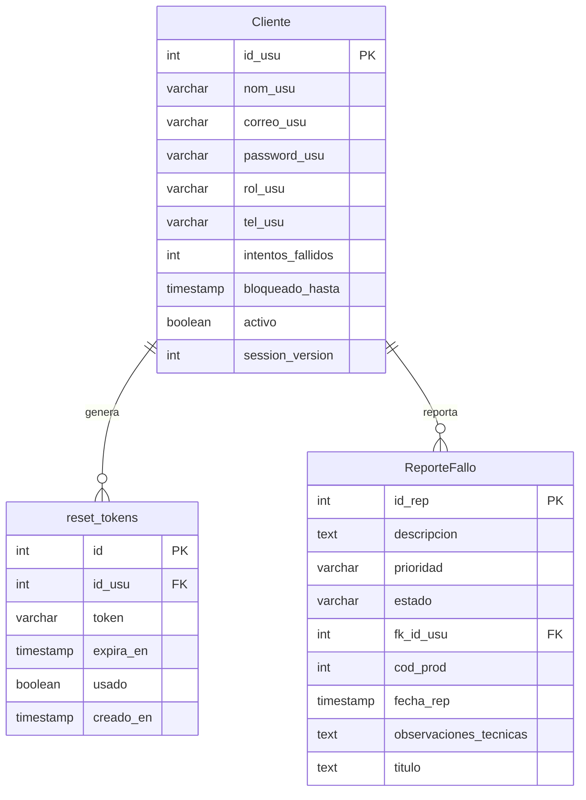
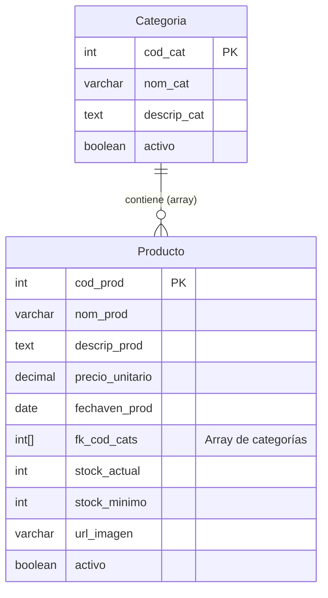
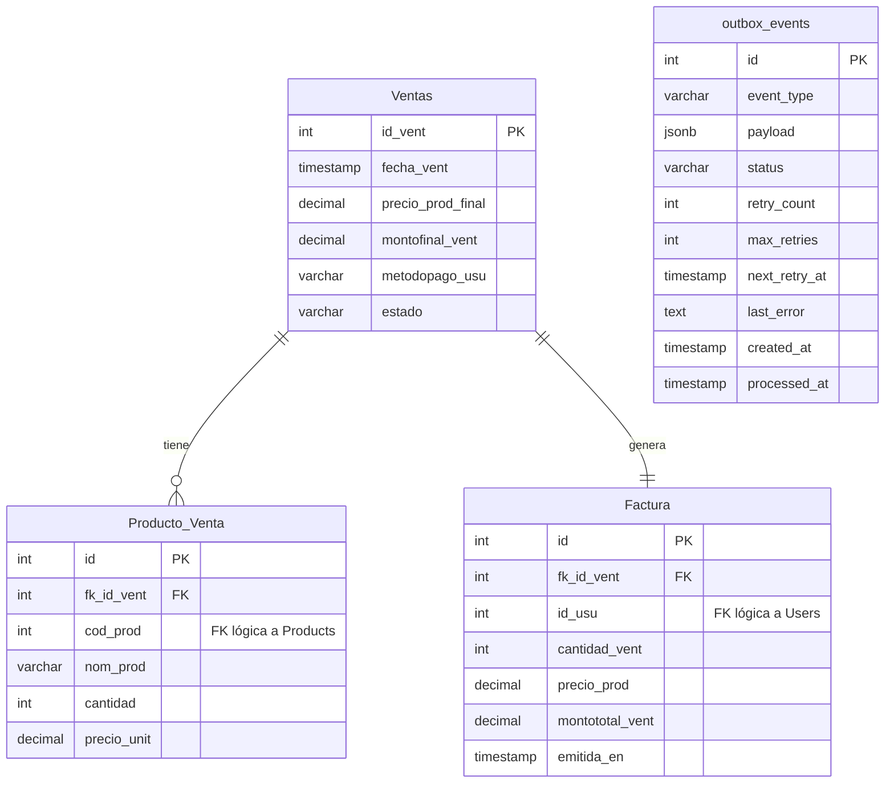
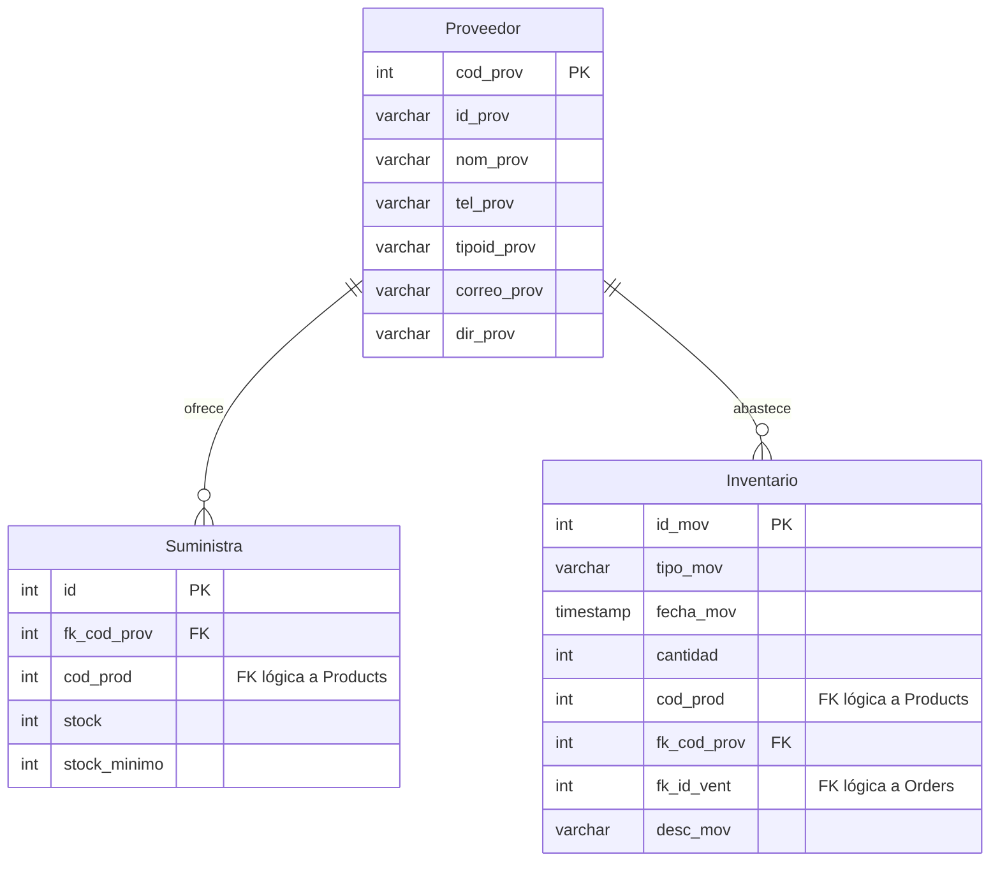

[[Home]] > **Arquitectura de Datos**

# Arquitectura de Datos y Bases de Datos (Kiora)

El backend utiliza una arquitectura policlóta / microservicios donde cada servicio tiene su propia base de datos física o lógica. Las "Claves Foráneas" (FK) entre dominios distintos son conceptuales y se resuelven a nivel de aplicación (HTTP), no a nivel de motor de base de datos.

A continuación se presentan los Diagramas Entidad-Relación generados a partir de los esquemas exportados de ChartDB.

---

##  Users Service (`kiora_users`)

Gestiona la autenticación, datos del cliente y tokens de recuperación.

---

##  Products Service (`kiora_products`)

Catálogo de productos y categorías.

---

## Orders Service (`kiora_orders`)

Ventas, detalles de venta y facturación, con soporte para el patrón Outbox.

---

## Inventory Service (`kiora_inventory`)

Gestión de stock, proveedores y auditoría de movimientos.

